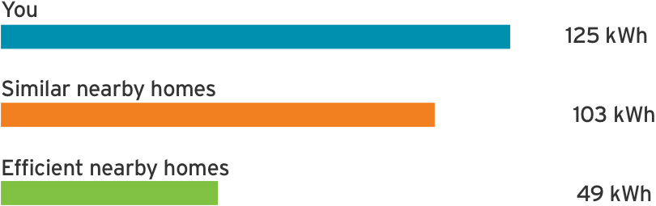
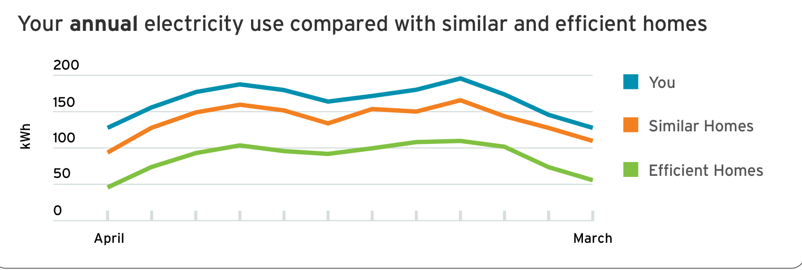
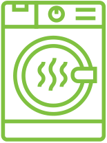

# Home Energy Report: electricity

March report Account number: 954137 Service address: 1627 Tulip Lane

Dear JILL DOE, here is your usage analysis for March.

Your electric use:

Above typical use

18% more than similar nearby homes

Nearby homes are defined as

Other homes with electricity

Homes within 9 km

Homes within +/- 300 sq. ft.

Nearby homes are based on fuel, distance and size. Square footage is collected from public information sources. Efficient nearby homes are the top 15 per cent efficient of similar-sized homes nearby.

Monthly savings tip: Do full laundry loads.

Waiting until you have a full load to run your laundry can save up to 6% of your energy use.

Watch this space for new ways to save energy each month.

Turn over for more savings ideas.

# Your top three tailored energy-saving tips

Caulk windows and doors Save money and energy

One of the biggest money-wasters in your home is drafty windows and doors. Caulking drafty areas is a simple DIY project that will pay off.

Upgrade your refrigerator Look for an Energy Star label

Older model refrigerators are very inefficient. You can make up the cost of a new Energy Star refrigerator in energy savings in just a few years.

Adjust thermostat settings Biggest energy saving option

Set your smart thermostat to save more 78�� energy during high-cost hours. Pre-heat your home on cold days so that you can save more energy.

Save more this spring

Reduce use and save money on your electric bill with these thorough tips, from the kitchen to the laundry room.

Evaluate your energy efficiency

Bring in the professionals! Assess your home's energy efficiency with a Home Energy Audit.
